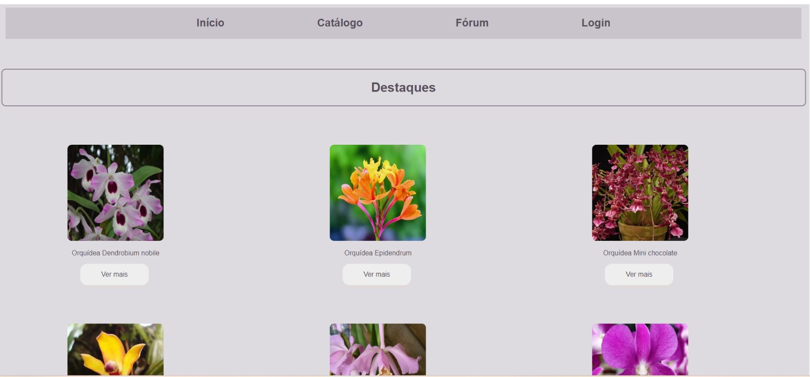
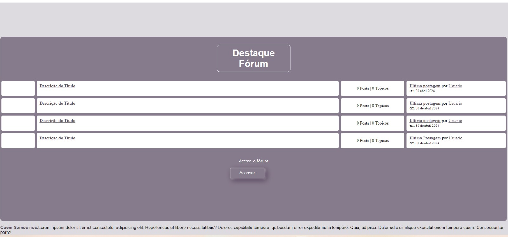
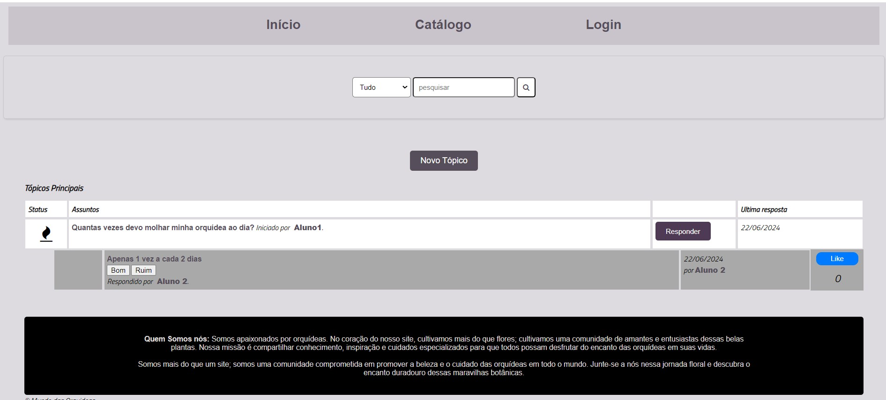
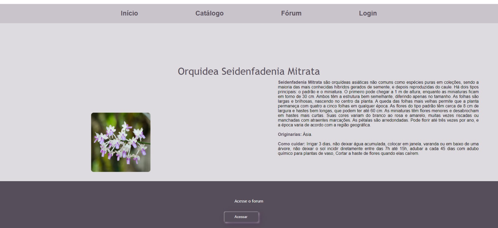

# Template da Aplicação

O site foi construido com linguagens HTML e CSS como marcação e a linguagem de programação JavaScript para implementação de elementos da página

Ao navegar pelo site as páginas terão como padrão um menu de navegação, o header e o footer, 
As páginas terão como elementos padrões o menu de navegação, o header e o footer, além dos elementos de identidade visual citados abaixo:

<ul>
<li>Cores: #C9C3CB, #564E5A, #D6D6D6,#867B8C </li>
<li>Font-family: Arial, Helvetica, URW Bookman L, serifArial, Helvetica, URW Bookman L, serif.</li>
<li>Font-size: 15px a 28px. </li>
</ul>

O código utilizado para a construção dos elementos citados, incluindo a responsividade, pode ser consultado <a href="https://github.com/ICEI-PUC-Minas-PMV-ADS/pmv-ads-2024-e1-proj-web-t15-mundo-das-orquideas/tree/main/docs/Codigo%20Fonte">aqui</a>. As imagens e ícones utilizados no projeto estão disponíveis <a href="https://github.com/ICEI-PUC-Minas-PMV-ADS/pmv-ads-2024-e1-proj-web-t15-mundo-das-orquideas/tree/main/docs/Codigo%20Fonte/Imagens">aqui</a>.

## Tela Principal

 Na tela principal é exibido as principais orquídeas, tópicos do fórum e o menu de navegação.
<figure>   

<figcaption> Figura 1 - Principais Orquídeas e menu navegação.
</figure>

<figure>   

<figcaption> Figura 2 - Tópicos do fórum
</figure>

## Tela fo fórum

A tela do fórum é possivel interação entre os usuários do site.

<figure>   

<figcaption> Figura 3 - Fórum
</figure>

## Tela Catálogo

 Dentro do catálogo é possivel verificar alguns tipos de orquídeas e informações adicionais.

<figure>   

<figcaption> Figura 4 - Catálogo de Orquídeas
</figure>
